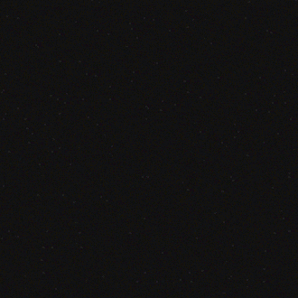

# [BouncingProjectile](BouncingProjectile.cs)

Extends `CustomProjectile` with bouncing behavior on non-destructable surfaces. When the projectile hits a wall or other non-destructable object, it reflects its direction across the hit normal instead of being disabled, consuming one of `Bounces` (defaults to 2). Once `Bounces` reaches 0 the projectile reverts to the default behavior and is disabled on wall contact. Setting `Wallbang` to `true` still causes the projectile to pass through walls without bouncing. The `OnBounce` callback fires on every bounce with the ray-cast hit and the projectile itself.

# [CommandHandler](CommandHandler.cs)

A registry and dispatcher for chat commands. Add `Command` instances to `ActiveCommands` and the handler automatically subscribes to user message events. The subscription is torn down when the last command is removed. Commands are matched case-insensitively, and `ModeratorOnly`/`HostOnly` commands are gated behind a permission check. Provides a `DisplayHelp` helper that lists all commands a user is allowed to run.

Example usage:

```cs
public static void OnStartup()
{
    // Normal command
    CommandHandler.ActiveCommands.Add(new("TEST", Test) {
        Description = "- This is a test command!"
    });

    // Moderator command
    CommandHandler.ActiveCommands.Add(new("MOD", Test) {
        Description = "- This is a moderator only command!",
        ModeratorOnly = true
    });

    // Host command
    CommandHandler.ActiveCommands.Add(new("HOST", Test) {
        Description = "- This is a host only command!",
        HostOnly = true
    });

    // Automatic help command
    CommandHandler.ActiveCommands.Add(new("T_HELP", CommandHandler.DisplayHelp) {
        Description = "- Displays command help."
    });
}

private static void Test(UserMessageCallbackArgs args) => Game.WriteToConsoleF("Hello World!");
```

# [CommandWrapper](CommandWrapper.cs)

A strongly-typed wrapper around `Game.RunCommand` for common chat commands — cheats, map rotation, player management, and more. Most commands only work when the script is loaded as a script extension and are silently ignored when run as a map script.

# [Companions](Companions.cs)

Helpers for managing bot companions on the main team, used in official-campaign-style map scripts where missing players are replaced by bots. `Initialize` scopes companion damage and starts a periodic update that syncs incoming damage with the game difficulty and keeps companions guarding a living player; `GetCompanions` and `SetBotName` expose team lookup and renaming. The `CompanionsFollow`/`CompanionsFight`/`GoToSaferoom` methods take `TriggerArgs` and are meant to be invoked directly from map triggers to retask the companions.

# [CreateInstance](CreateInstance.cs)

A generic factory helper that instantiates a `Type` by reflecting over its public constructor and casting the result to `T`. Throws `InvalidOperationException` when no matching constructor exists.

# [CustomProjectile](CustomProjectile.cs)

A fully customizable projectile that travels in a straight line, performs its own ray-cast collision each update, and fires a single `OnHit` callback on impact (use `RayCastResult.IsPlayer` to distinguish between players and objects). Supports piercing (multiple hits before disabling), wallbanging through indestructible geometry, a maximum travel distance, a trailing effect, and a copy constructor for easy templating.

# [EffectNamesExtra](EffectNamesExtra.cs)

Undocumented `Game.PlayEffect` effect names exposed as constant strings, following the same pattern as `EffectName`. Each entry documents the expected argument signature for the extra parameters after position.

| Constant | Value | Args | Description |
|---|---|---|---|
| `MuzzleFlash` | `"MZLED"` | `(int objectId, string muzzleFlashType)` | Muzzle flash on any object; types in `MuzzleFlashTypes` |
| `OutOfAmmoRecoil` | `"OOAC"` | `(int playerId)` | Out-of-ammo recoil animation |
| `PickupText` | `"PWT"` | `(string weaponId)` | Weapon pickup text (plain or with `_ammo` suffix) |
| `FireNodeFlamethrowerStart` | `"FNFTST"` | `(float dirX, float dirY)` | FireNode flamethrower start (direction; origin = `PlayEffect` position) |
| `FireListener` | `"FLST"` | `(int objectId)` | Fire listener (purpose unconfirmed) |

# [GetRandomWeaponFromType](GetRandomWeaponFromType.cs)

Returns a random `WeaponItem` whose `WeaponItemType` matches the given category. Internally draws random weapons via `Game.GetRandomWeaponItem` and spawns them transiently to inspect their type, retrying until a match is found.

# [HomingProjectile](HomingProjectile.cs)

Extends `CustomProjectile` with self-steering behavior. Each update it rotates its direction towards a target position — by default the closest living enemy of `Owner` — with `Homing` (0–1) controlling how aggressively it turns. Override `GetHomingTargetPosition` to implement custom targeting.

# [NodeProjectile](NodeProjectile.cs)

Extends `CustomProjectile` with FireNode-like physics: forward travel, gravity pull, horizontal friction, and a configurable lifetime. While airborne it casts swept raycasts along its traveled path (like the base class), so it can hit players reliably in flight. Once it settles on a surface, collision detection switches to a vertical raycast segment centered on the projectile. With `Lingering` enabled the projectile settles on non-destructible surfaces instead of being disabled, and keeps sensing nearby targets every 50ms like a proximity mine until `Lifetime` expires.

> [!NOTE]  
> Note that non-destructible objects still "land" by default (decrementing `PiercingTargets`), so to make `Lingering` effective either raise `PiercingTargets` or return `false` from `OnHit` for non-destructible objects.

# [ParseHelper](ParseHelper.cs)

Reusable string parsers for common SFD types, aimed at chat commands. `ParseUsers` resolves a string against active users — by `GameSlotIndex` for numeric input, or by `AccountName`/`Name`, with `"me"` (the invoking user) and `"*"` (all users) shortcuts. `ParsePlayers` does the same for players, matching real players first via the user parser and falling back to `IObject.Name` to also catch externally spawned bots, with `"*"` resolving to all players. Each method takes a `ParseFlags` bitmask to select which operations to attempt (default `Everything`), evaluated in a fixed secure order — index, account name, name, then special tokens — so a literal collision like a user named `"me"` is still matched by user data first. Both return an empty collection when nothing matches and use a configurable `StringComparison` (default case-insensitive).

# [PlayerHelper](PlayerHelper.cs)

Generic utilities for `IPlayer`, such as unsticking players from geometry and querying firing state.

# [ProjectileHelper](ProjectileHelper.cs)

General-purpose utilities for `IProjectile`.

# [PointShape](PointShape.cs)

Static helpers that generate collections of `Vector2` points along common shapes — trails, circles, squares/polygons, swirls and waves — plus a random-in-area generator. Each method invokes a callback for every produced point, so they can be used to drive effects, spawns, or any point-wise operation. Includes a `DegreesToRadians` conversion helper.



# [RandomHelper](RandomHelper.cs)

Helpers for generating random values. `GetRandomColor(Random)` returns a `Color` with fully random RGB values and opaque alpha.

# [ShowChatMessages](ShowChatMessages.cs)

Batch wrapper around `Game.ShowChatMessage` that accepts an `IEnumerable<string>` of messages and displays each one as its own line in the chat. Mirrors the four overloads of the underlying API: bare, colored, user-targeted, and colored-user-targeted.

# [Vector2Helper](Vector2Helper.cs)

A math utility class for `Vector2` offering operations not built into the SFD API: angles, dot/cross products, reflection and bouncing, projection, rotation, clamping, length limiting, move-toward, and more. Also exposes the `Up`/`Down`/`Left`/`Right` unit vectors.
